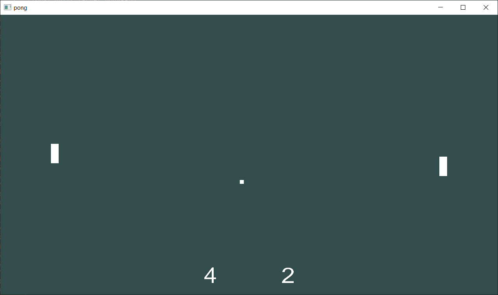

# Pong

It's Pong. No further explanation needed.

Move left paddle up and down using W/S or Up/Down keys.
Computer controls the right paddle.
Escape to quit.



## Prerequisities

* OpenGL
* Cmake

## Dependencies

Submodules have been added by running
```sh
git submodule add REPO-URL
```

To update submodule, run
```sh
git submodule update --init -- REPO-NAME
```

The submodules are
* https://github.com/glfw/glfw
* https://github.com/g-truc/glm.git
* https://github.com/nothings/stb.git
* https://github.com/unittest-cpp/unittest-cpp.git

### GLAD

GLAD is generated and downloaded from https://glad.dav1d.de/
Generated for gl Core 4.6 and gles 2 version 3.2.
Generated files have been copied to src/main/glad

## Build

```sh
mkdir build
cd build
cmake ..
make
```

### Windows
If running with MSYS on Windows appending a generator on the cmake call is recommended.

```sh
cd build
cmake .. -G "MSYS Makefiles"
```

## Run

```sh
cd build
./pong-app
```

## Test

```sh
cd build
./pong-test
```
